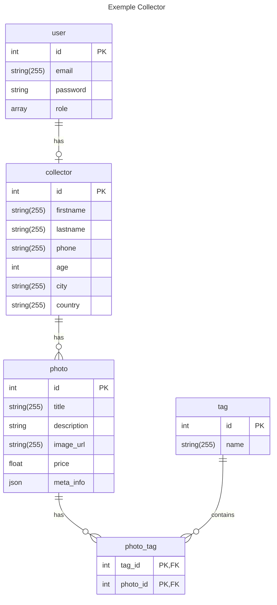

# Site de E-commerce

## Réflexion autour des entités

Nous allons concevoir notre Diagramme relationnel d'entité (erDiagram).

- de quelles entités avons nous besoin ?
- qu'elles sont les relations entre ces entités ?


**Par étape :**

- fournir une liste de toutes les entités 
- penser les propriétés de ces entités
- définir les relations entre chaque entités 

### Entités définies ensemble 

- User
- Customer
- CustomerAddress
---
- Category
- Product
- Review
---
- Order
- OrderLine
  - product
  - qty
  - price
- Payment


## Mermaid 

**🖥️ Prise en main de Mermaid.**
https://mermaid.js.org/syntax/entityRelationshipDiagram.html

Nous allons définir ensuite notre Diagram relation d'entités à l'aide Mermaid.

- Créer un fichier readme.md
- Structurer le document avec un chapitre `Diagramme relationnel d'entités`
- Concevoir le Diagram

**ℹ️ Pour en savoir plus


    ⚠️ Le fichier `readme.md` sera utilisé comme documentation de notre projet.
    Il sera placé à la racine de votre projet et comportera en plus les informations pour l'installation et la configuration de votre projet.


### Les relations entre entités avec Mermaid

| Value (left) | Value (right)	| Meaning
| :--------------- |:---------------:| -----:|
| \\|o |	o\\|	| Zero or one 
| \\|\\| | \\|\\|	| Exactly one 
|}o	 | o{ |	Zero or more (no upper limit)
| }\\| |	\\|{	| One or more (no upper limit)


### Exemple




### Notre ErDiagramm


## Installation

1. Cloner le dépôt github
2. Configurez le fichier `.env` pour définir la connexion à votre serveur de base de donnée (copier le vers un `.env.local` pour un fonctionnement en local)
3. Installer les dépendances PHP
   
```bash 
    # charge les dépendances PHP 
    composer install
```

4. Installer les dépendances pour les Assets (AssetsMapper)
```bash 
    # charge les dépendances des assets (JS /CSS) 
    php bin/console importmap:install
```
   
6. Créer la base de données :

```bash 
    # créer la base de donnée (d:d:c)
    php bin/console doctrine:database:create
```

7. Mettre à jour le schéma de la base 

```bash
    # migration 
    php bin/console doctrine:migrations:migrate 
    # OR update schema
    php bin/console doctrine:schema:update
```

8. Charger les fixtures pour créer du contenu

```bash
    # Fixtures
    php bin/console doctrine:fixture:load 
```

8. Lancer le serveur Symfony

```bash
    # Fixtures
    symfony serve
```

9. Accéder au site
   1. Front : `127.0.0.1:8000`
   2. Admin : `127.0.0.1:8000/admin`
      - user : admin@admin.fr
      - password : 123456
 

## Etapes de construction du projet 

### Créations des entités

- Créer toutes les entités selon notre ErDiagramm
- Ne pas créer les relations ni les champs Timestamp et Slug
- Créer 2 Traits pour la gestion du Slug et des timestamp sur les entités qui en ont besoin

    https://symfony.com/doc/current/string.html#slugger
    https://symfony.com/doc/current/doctrine/events.html#doctrine-lifecycle-callbacks

- Ajouter vos Trait aux entités qui en ont besoin. Ne pas oublier de rajouter le `use` dans la classe de l'entité et l'attribut `#[ORM\HasLifecycleCallbacks]` au dessus de la définition de la classe de l'entité qui use ce/ces Traits 

```php
// src/Entity/Photo.php 

#[ORM\Entity(repositoryClass: PhotoRepository::class)]
#[ORM\HasLifecycleCallbacks]
class Photo
{
    use TimestampableEntity;
    use SlugableEntity;
    ...  
}
```

- Faire une migration pour migrer les entités vers la base de données

### Premier partie : administrer les User ADMIN


- créer un controller pour la page d'accueil du site FrontController
- créer un controller pour l'ajout d'un utilisateur dans le BackOffice AdminUserController
- utiliser le `make:crud` pour générer le CRUD de la création d'un User
- appliquer les optimisations :
  - modification du type form pour enlever le customer et les dates (auto-générées),
   - mot de passe double saisie et non mappé avec l'entité, et ajout de contraintes sur le mot de passe (non vide et longueur en 6 et 80 caractères)
   - hash du mot de passe dans le controller
   - joindre la route de l'édit sur l'ajout dans le controller (utiliser le @paramConverter et une valeur par défaut à null)
   - passer un paramètre édit à la vue pour gérer le text différent entre l'ajout et l'édition
   - gérer les traductions dans les vues twig et dans le type avec un domaine `admin`
   - créer le fichier de traduction associé et définissez la local par défaut à `fr`
   - gérer un layout différent pour l'admin : ajouter bootstrap pour l'admin (créer un point d'entrée pour AssetMapper)
- créer un nouvel utilisateur avec un mot de passe et le ROLE_ADMIN
- sécuriser les routes commençant pas admin/ dans le fichier de config `security.yaml`
- créer un form de login avec `make:security:form-login`
- regarder du côté de la gestion de la locale avec Symfony. L'idée serait de passer la locale dans le route `admin/fr/user` ou `admin/en/user`

**Important**
- créer les tests associés pour le CRUD et le form de login
- valider ses tests (apporter les modifications nécessaire aux tests à la création puis tester à chaque étape)

### Création d'un formulaire d'enregistrement côté Front - Email de validation

- créer un registration form avec le maker associé et validez la validation par email et la création du test. Pensez à migrer !
- créer un formulaire pour l'entité Customer
- imbriquer ce formulaire dans le formulaire de registration pour demander les infos Customer (possible du fait de la relation OneToOne des deux entités User et Customer et à la persistance du Customer avec User), puis configurer la vue twig pour afficher les champs correctement,
- télécharger ou installer MailHog selon votre configuration, puis executez le 
- configurer le .env.local pour rediriger les emails vers MailHog (`MAILER_DSN=smtp://127.0.0.1:1025?auth_mode=login`)
- les emails seront pour le moment placés dans la queue de `symfony/messenger`
- pour vider la queue utiliser la commande `php bin/console messenger:consume async` ou commentez la ligne `Symfony\Component\Mailer\Messenger\SendEmailMessage: sync` dans le fichier `config/packagers/messenger.yaml` pour un envoie immédiat des emails
- modifier le controller pour affecter le rôle `ROLE_CUSTOMER` lors de l'enregistrement
- vous pouvez maintenant créer un compte utilisateur et valider son fonctionnement
- vous pouvez aussi regarder le test fonctionnel créé et le lancer pour tester si tout est ok (vous devez le modifier pour y intégrer les données du Customer et regarder du côté des assert pour l'envoie de l'email si vous ne le gérez plus avec messenger, dans ce cas plus de test possible sur l'email dans le queue)

### Création de fixtures pour ajouter des produits dans la base

- nous allons installer le bundle fixture : `composer require --dev orm-fixtures`
- nous allons installer le paquet faker pour générer des données Fake : https://packagist.org/packages/fakerphp/faker
- créer la fixture pour créer toutes les données de notre site

```php

class AppFixtures extends Fixture
{

    public function __construct(Private UserPasswordHasherInterface $passwordHasher)
    {
        
    }

    public function load(ObjectManager $manager): void
    {
        $faker = \Faker\Factory::create('fr_FR');

        // Création d'un utilisateur ADMIN
        $user = new User();
        $user->setRoles(['ROLE_ADMIN'])
        ->setEmail('admin@admin.fr')
        ->setPassword($this->passwordHasher->hashPassword($user,'123456'))
        ->setVerified(true);

        $manager->persist($user);


        // Création des catégories
        $categories = [];

        for ($j = 0; $j < 150; $j++) {
            $category = new Category();

            $category->setName($faker->realTextBetween(10, 20));

            $categories[] = $category;

            $manager->persist($category);
        }

        // TVA 2 valeurs
        $tva = new Tva();
        $tva->setName('Tva 20%')->setValue(0.2);

        $manager->persist($tva);

        $tva2 = new Tva();
        $tva2->setName('Tva 10%')->setValue(0.1);

        $manager->persist($tva2);

        //Création des produits
        for ($i = 0; $i < 150; $i++) {
            $product = new Product();

            $product->setName($faker->realTextBetween(10, 30))
                ->setDescription($faker->realTextBetween(150, 600))
                ->setPrice($faker->randomFloat(2, 10, 300))
                ->setStock($faker->randomDigit())
                ->setTva($tva);

            $nbCategory = random_int(1, 10);
            for ($k = 0; $k < $nbCategory; $k++) {
                shuffle($categories);
                $product->addCategory($categories[0]);
            }


            for ($l = 0; $l < 10; $l++) {
                $image = new ProductImage();
                $image->setName($faker->realTextBetween(10, 30))
                ->setFile("https://picsum.photos/id/". $faker->numberBetween(1, 1080)."/1024" )
                ->setProduct($product);

                $manager->persist($image);
            }

            for ($m = 0; $m < random_int(3, 20); $m++) {

                //Create Customer/User for Review
                $user = new User();
                // désactivation du hash... fixture trop longue a éxecuter sinon
                //$user->setEmail($faker->email())->setPassword($this->passwordHasher->hashPassword($user, $faker->password()))->setRoles(['ROLE_CUSTOMER']);
                $user->setEmail($faker->email())->setPassword($faker->password())->setRoles(['ROLE_CUSTOMER']);

                $manager->persist($user);

                $customer = new Customer();
                $customer->setFirstname($faker->firstName())
                    ->setLastname($faker->lastName())
                    ->setBithdateAt(new \DateTimeImmutable($faker->date()))
                    ->setPhone($faker->phoneNumber())
                    ->setUser($user);

                $manager->persist($customer);

                // création Review
                $review = new Review();
                $review->setContent($faker->realTextBetween(50, 300))
                ->setNote($faker->numberBetween(1, 5))
                ->setProduct($product)
                ->setCustomer($customer);

                $manager->persist($review);


            }

            $manager->persist($product);
        }

        $manager->flush();

    }
}

```