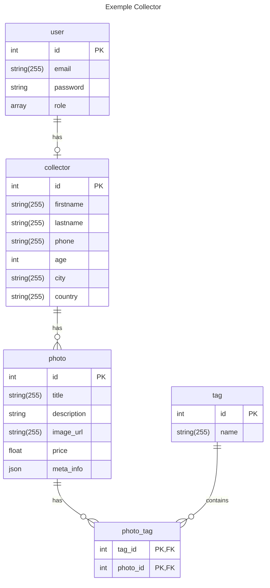
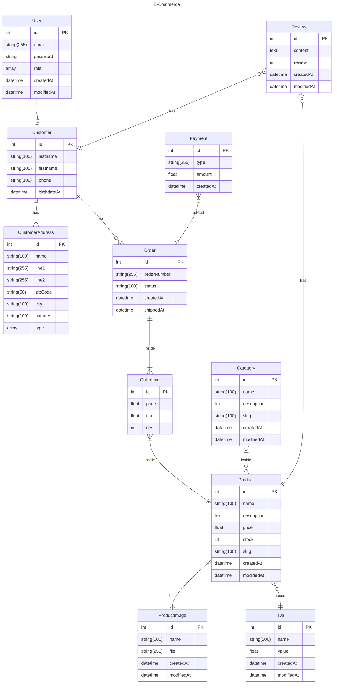

# Site de E-commerce

## Réflexion autour des entités

Nous allons concevoir notre Diagramme relationnel d'entité (erDiagram).

- de quelles entités avons nous besoin ?
- qu'elles sont les relations entre ces entités ?


**Par étape :**

- fournir une liste de toutes les entités 
- penser les propriétés de ces entités
- définir les relations entre chaque entités 

### Entités définies ensemble 

- User
- Customer
- CustomerAddress
---
- Category
- Product
- Review
---
- Order
- OrderLine
  - product
  - qty
  - price
- Payment


## Mermaid 

**🖥️ Prise en main de Mermaid.**
https://mermaid.js.org/syntax/entityRelationshipDiagram.html

Nous allons définir ensuite notre Diagram relation d'entités à l'aide Mermaid.

- Créer un fichier readme.md
- Structurer le document avec un chapitre `Diagramme relationnel d'entités`
- Concevoir le Diagram

**ℹ️ Pour en savoir plus


    ⚠️ Le fichier `readme.md` sera utilisé comme documentation de notre projet.
    Il sera placé à la racine de votre projet et comportera en plus les information pour l'installation et la configuration de votre projet.


### Les relations entre entités avec Mermaid

| Value (left) | Value (right)	| Meaning
| :--------------- |:---------------:| -----:|
| \\|o |	o\\|	| Zero or one 
| \\|\\| | \\|\\|	| Exactly one 
|}o	 | o{ |	Zero or more (no upper limit)
| }\\| |	\\|{	| One or more (no upper limit)


### Exemple




### Notre ErDiagramm



## Installation

Cloner le github


```bash 

    php bin/console d:d:c

 
    # Fixtures
    php bin/console 

```

## Commande Symfony utilisées

```bash

    # Creation d'entité
    php bin/console make:entity

```